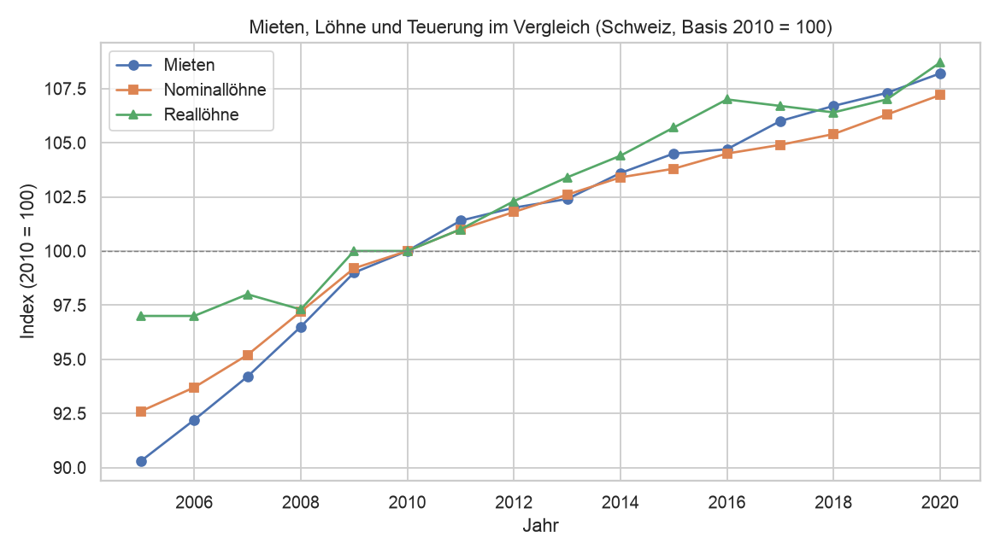
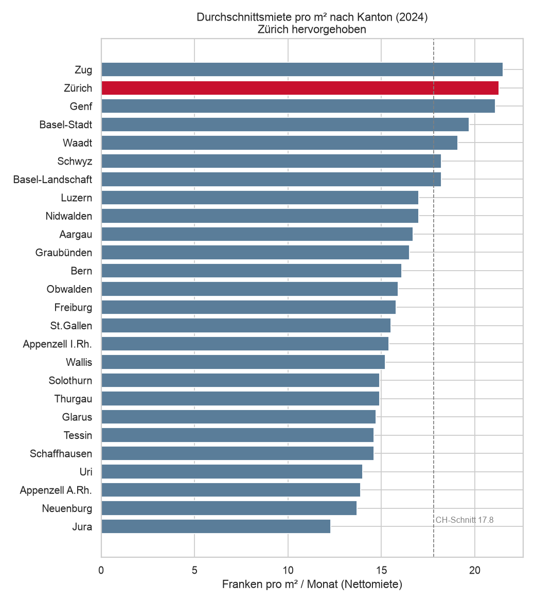
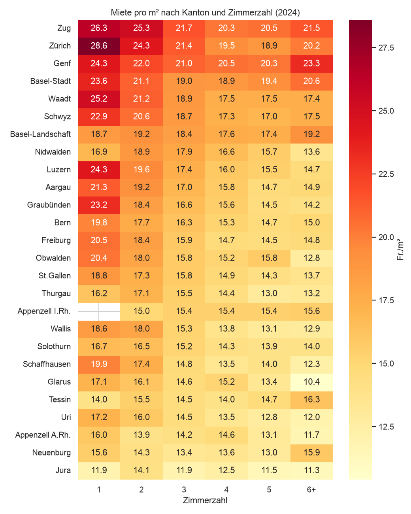
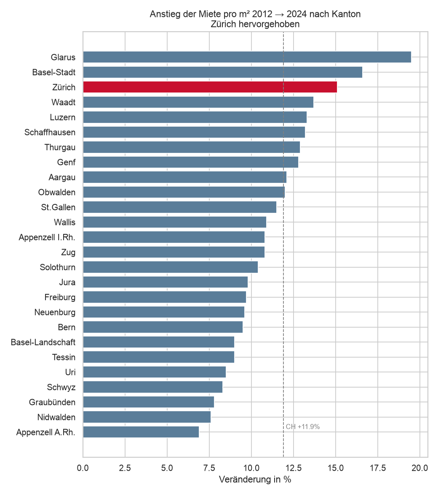

# Entwicklung der Wohnungsmieten in der Schweiz

Eine Datenanalyse mit Python (und Power BI) auf Basis offener Daten des Bundesamts für Statistik (BFS). Untersucht werden zwei Forschungsfragen.

---

## Einfach erklärt

**Worum geht es?** Mieten steigen – das spürt jede:r. Dieses Projekt prüft mit offiziellen Zahlen zwei Dinge: *Steigen die Mieten schneller als die Löhne?* und *In welchen Kantonen ist es am extremsten?*

**Kurzantworten:**
- **Frage 1:** Die Mieten sind gestiegen (rund +8 % zwischen 2010 und 2020), aber die Löhne sind ungefähr gleich schnell mitgewachsen. Weil die allgemeinen Preise kaum stiegen, blieb am Monatsende real etwa gleich viel übrig.
- **Frage 2:** Am teuersten wohnt man in Zug, **Zürich** und Genf, am günstigsten im Jura. Die teuren Kantone wurden tendenziell noch teurer – Zürich gehört bei Preis-Niveau *und* Anstieg zu den Top 3.

**Begriffe kurz erklärt:**

| Begriff | Was es bedeutet |
|---|---|
| **Nominallohn** | Der Lohn in Franken, wie er auf dem Lohnzettel steht – ohne Berücksichtigung der Preise. |
| **Reallohn** | Der Lohn umgerechnet auf die *Kaufkraft*: Wie viel man sich davon wirklich leisten kann. Steigt der Reallohn, sind die Löhne schneller gewachsen als die Preise. |
| **Teuerung / Inflation** | Wie stark die Preise allgemein steigen (gemessen am Landesindex der Konsumentenpreise, LIK). |
| **Mietpreisindex** | Eine Messzahl, die zeigt, wie sich die Mieten über die Zeit verändern – nicht in Franken, sondern relativ zu einem Startjahr (hier Dezember 2015 = 100). |
| **Index (z. B. 2010 = 100)** | Ein Trick, um Dinge mit unterschiedlichen Einheiten vergleichbar zu machen: Man setzt ein Jahr auf 100 und misst alles andere daran. Bei 108 ist der Wert 8 % höher als im Startjahr. |
| **Fr./m²** | Monatsmiete pro Quadratmeter. So lassen sich grosse und kleine Wohnungen fair vergleichen. |

---

## Frage 1 — Mieten, Löhne und Teuerung

### Frage

> Wie stark sind die Wohnungsmieten in der Schweiz in den letzten 10–15 Jahren gestiegen — und hielt das mit der Lohn- und Teuerungsentwicklung Schritt?

### Herleitung

- **Daten:** Mietpreisindex des BFS (Basis Dez. 2015 = 100) sowie eine BFS-Reihe mit Nominal­löhnen, Real­löhnen und Konsumentenpreisen.
- **Vorgehen:** Der Mietpreisindex liegt in einem verschachtelten Excel-Layout vor und wird zuerst in eine saubere Tabelle umgeformt. Anschliessend werden Mieten und Löhne auf ein gemeinsames Basisjahr (2010 = 100) umgerechnet, damit die Kurven vergleichbar sind.
- **Notebooks:** [`01_datenaufbereitung.ipynb`](notebooks/01_datenaufbereitung.ipynb) · [`02_analyse.ipynb`](notebooks/02_analyse.ipynb)

### Ergebnis



- **Mieten 2010–2020: rund +8 %** — ein spürbarer, aber moderater Anstieg.
- Die Mieten stiegen **leicht schneller als die Nominallöhne** (+8,2 % vs. +7,2 %).
- **Trotzdem kein realer Kaufkraftverlust:** Die Reallöhne legten am stärksten zu (+8,7 %), weil die Teuerung im Jahrzehnt sehr tief war. Die Löhne hielten also mit den Mieten Schritt.

> Datenstand bis 2020 (Grenze der Lohnreihe). Der starke Miet- und Preisanstieg ab 2022 ist noch nicht enthalten.

---

## Frage 2 — Mieten nach Kanton

### Frage

> Welche Kantone sind beim Mietniveau und beim Mietanstieg Spitzenreiter, welche Nachzügler — und wo steht der Kanton Zürich?

### Herleitung

- **Daten:** BFS-Strukturerhebung, durchschnittliche Nettomiete **pro m²** nach Kanton und Zimmerzahl. Die Zeitreihe 2012–2022 stammt aus einer mehrblättrigen BFS-Tabelle (ein Blatt pro Jahr), das aktuellste Jahr 2024 aus der Einzeltabelle.
- **Vorgehen:** Jedes Jahres-Blatt wird mit derselben Funktion bereinigt (Kopfzeilen und Vertrauensintervalle entfernen, Fussnoten herausfiltern) und zu einer durchgehenden Zeitreihe zusammengeführt.
- **Notebook:** [`03_frage2_kantone.ipynb`](notebooks/03_frage2_kantone.ipynb)

### Ergebnis — Niveau 2024



- Teuerste Kantone: **Zug (21,5), Zürich (21,3), Genf (21,1)** Fr./m²; günstigste: **Jura (12,3), Neuenburg (13,7), Appenzell A.Rh. (13,9)**.
- **Zürich liegt auf Rang 2 von 26** und rund 20 % über dem Schweizer Schnitt (17,8 Fr./m²).
- Kleine Wohnungen kosten pro m² am meisten – sichtbar als Hell-zu-Dunkel-Verlauf von links (1 Zimmer) nach rechts in der Heatmap.



### Ergebnis — Entwicklung 2012–2024



- Schweizweit stiegen die Mieten pro m² um **rund +12 %** (+11,9 %).
- Am stärksten: **Glarus (+19,5 %), Basel-Stadt (+16,6 %), Zürich (+15,1 %)**; am wenigsten Appenzell A.Rh. (+6,9 %).
- **Zürich ist sowohl im Niveau (Rang 2) als auch beim Anstieg (Rang 3) vorne** — teure Kantone wurden tendenziell noch teurer.

> 2023 ist in den offenen Daten nicht enthalten; ab 2018 gab es methodische Anpassungen, die Werte pro m² sind aber gut vergleichbar.

---

## Daten und Methodik

| Datensatz | Quelle | Verwendung |
|---|---|---|
| Mietpreisindex (Entwicklung der Mietpreise für Wohnungen, Jahresdurchschnitte) | BFS – LIK | Frage 1: Mietentwicklung über die Zeit |
| Nominallöhne, Konsumentenpreise und Reallöhne | BFS | Frage 1: Vergleich Löhne ↔ Teuerung (Lohn- *und* Preisentwicklung in einer Datei) |
| Durchschnittlicher Mietpreis pro m² nach Zimmerzahl und Kanton (2012–2022 + 2024) | BFS – Strukturerhebung | Frage 2: Mieten nach Kanton, Niveau und Anstieg |

Alle Daten stammen von [opendata.swiss](https://opendata.swiss) bzw. [bfs.admin.ch](https://www.bfs.admin.ch). Rohdaten liegen unverändert unter `data/raw/`, bereinigte Daten unter `data/processed/`.

## Projektstruktur

```
data/
  raw/          Rohdaten, unverändert wie heruntergeladen
  processed/    bereinigte, analysefertige Daten
notebooks/      Jupyter Notebooks (Aufbereitung + Analyse)
figures/        erzeugte Grafiken
powerbi/        Power-BI-Datei (.pbix) und Dashboard-Screenshots
```

## Selbst reproduzieren

```bash
python3 -m venv .venv
source .venv/bin/activate
pip install -r requirements.txt
```

Anschliessend die Notebooks in VS Code öffnen, den Kernel `.venv` wählen und „Run All" ausführen. Die Notebooks erzeugen die bereinigten Daten und alle Grafiken neu.

## Verwendete Werkzeuge

Python (pandas, matplotlib, seaborn), Jupyter, Power BI Desktop.

---

*Lernprojekt — entwickelt mit Unterstützung von Claude Code.*
